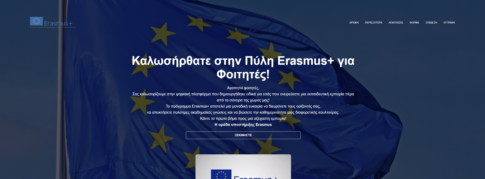

# Erasmus Application Portal  

A web application for Erasmus program participation, developed as a university project.  
Users can submit an application, track its status, and read the participation terms.  
Access to these features is available only to registered and logged-in users.  

---

## 🚀 Features  
- User authentication (login required)  
- Submit Erasmus applications  
- Track application status  
- Read terms and conditions for participation  

---

## 🛠️ Tech Stack  
- **Frontend:** HTML, CSS, JavaScript  
- **Backend:** PHP (REST API with JSON)  
- **Database:** MySQL (via phpMyAdmin)  
- **Server environment:** Apache & MySQL (XAMPP)  

---

## 📦 Installation & Setup  

1. **Move the project folder** into the `htdocs` directory of your **XAMPP** installation.  

2. **Start services** from the XAMPP Control Panel:  
   - Apache  
   - MySQL  

3. **Set up the database:**  
   - Open [http://localhost/phpmyadmin](http://localhost/phpmyadmin)  
   - Create a new database (e.g., `erasmus_db`)  
   - Import the provided `.sql` file (if included)  

4. **Access the project:**  
   - Open [http://localhost/erasmus-portal](http://localhost/erasmus-portal) in your browser  

---

## 📖 Usage  

- Register a new account or log in with existing credentials  
- Submit an Erasmus application form  
- Check the status of your application  
- Read Erasmus program terms and conditions  

---

## 📌 Notes  

- This project was created for academic purposes  
- Runs locally via XAMPP  
- Deployment to a live server requires additional configuration
- Administrator privileges can only be assigned via the database.

---
## Ενδεικτικά Screenshots

---
  
## 📄 License

© 2025 Anastasios Kalomoiris , Ioanna Taxiarchia Michou.  
All rights reserved.  

This project is proprietary and may not be copied, modified, or distributed without the author's explicit permission.
